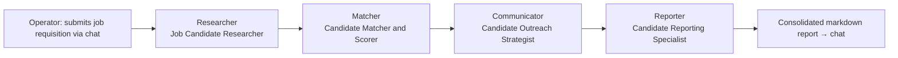

# Recruitment Assistant

A personal, single-operator multi-agent tool that turns one job requisition into a researched,
scored, and outreach-ready candidate shortlist — modeled on the [CrewAI `recruitment`
example](https://github.com/crewAIInc/crewAI-examples/tree/main/crews/recruitment) and built with the
AAMAD framework's Define → Build → Deliver workflow (see [`AGENTS.md`](AGENTS.md) and
[`CHECKLIST.md`](CHECKLIST.md)).

> **Status**: Phase 1 (Define) complete. Phase 2 (Build) has not started — there is no application code
> in this repository yet. See [Project Structure](#project-structure) and [Next Steps for
> Contributors](#next-steps-for-contributors) below.

Full requirements live in [`project-context/1.define/prd.md`](project-context/1.define/prd.md) (PRD) and
[`project-context/1.define/mrd.md`](project-context/1.define/mrd.md) (MRD). This README summarizes them;
the PRD is the source of truth if anything here drifts.

## Problem Statement & Value Proposition

Sourcing candidates, scoring them against a job's requirements, and drafting outreach messages is
repetitive manual work when done one-by-one for a single open role. This project automates that pipeline
for **one operator** (a recruiter or hiring manager working their own requisition) so that most of the
sourcing/scoring/drafting effort shifts from the operator to an automated agent pipeline, leaving the
operator to focus on writing the requisition and acting on the final report.

This is a **personal, non-commercial tool** — there is no target market, pricing, or go-to-market
strategy (see PRD §1–2, §9). Value is measured in personal time saved and in whether the operator finds
each run's report good enough to act on (see [Success Metrics](#success-metrics)).

## Key Features

MVP scope (PRD §4, Priority P0):

- **Submit a job requisition** (title, description, responsibilities, requirements, preferred
  qualifications, perks) through a chat interface and trigger a single end-to-end run.
- **Candidate research** — find a bounded list of candidates (default: 10) with contact info and a brief
  suitability profile, sourced via web search/scraping only (no LinkedIn scraping — see
  [Architecture](#application-architecture) below).
- **Match & score** — rank candidates against the requisition with a score and written justification per
  candidate.
- **Outreach strategy drafting** — generate outreach methods and message templates per candidate/segment.
  **Draft-only**: no message is sent to any candidate automatically.
- **Consolidated report** — one markdown report combining candidates, scores/justifications, and outreach
  drafts, rendered back in the chat interface.

Deferred to Future Work (PRD §4, P2): authenticated LinkedIn sourcing, actual outreach sending,
persistent storage across runs, multi-requisition/multi-user support.

### Success Metrics

- **Recruiter time saved (hours/week)** — the primary intended benefit. There is currently no sourced
  manual-time baseline; the operator is expected to self-log their own pre-tool time so the metric has a
  real comparison point (PRD §7). This is an open item, not a committed number — see
  [Next Steps](#next-steps-for-contributors).
- Technical: a run completes end-to-end without manual intervention; candidate list stays within the
  bounded default to control LLM/search cost.
- UX: qualitative — the operator finds the report usable enough to act on.

## Application Architecture

A sequential, four-agent [CrewAI](https://github.com/crewAIInc/crewAI) pipeline (`Process.sequential`, no
inter-agent delegation), adapted from the reference example:



| Agent | Role | Goal | Tools (MVP) |
|---|---|---|---|
| `researcher` | Job Candidate Researcher | Find potential candidates for the job | Web search, website scraping |
| `matcher` | Candidate Matcher and Scorer | Match candidates to the job and score them | Web search, website scraping |
| `communicator` | Candidate Outreach Strategist | Develop outreach strategies for selected candidates | Web search, website scraping |
| `reporter` | Candidate Reporting Specialist | Report the best candidates to the recruiter | None — synthesizes prior agents' output |

**Design notes** (see PRD §3 for full detail):

- Each stage's output feeds the next via task context-chaining — you can't score candidates that haven't
  been found, and you can't draft outreach for candidates that haven't been scored.
- **The reference example's LinkedIn-cookie-scraping tool is intentionally excluded from MVP scope.** The
  original example's own README states that approach may violate LinkedIn's Terms of Service and risks
  account bans; this project sources candidates via public web search/scraping only instead. Re-adding an
  authenticated LinkedIn integration is tracked as Future Work and would need its own security/legal
  review first.
- No database — each run is stateless (job requisition in, report out); no candidate data is persisted
  server-side at MVP.
- Runtime target: `crewai` (from [`aamad.config.yml`](aamad.config.yml)). LLM provider/model and
  web-search provider are still open decisions — see [Next Steps](#next-steps-for-contributors).
- Interface: a minimal chat UI (not a bare CLI), per this repo's `@frontend.eng` convention — see
  [`AGENTS.md`](AGENTS.md).

## Getting Started

There is no runnable application yet — Phase 2 (Build) hasn't produced code. Once Build is complete, this
section should be updated with real setup/run instructions (see `setup.md` under
`project-context/2.build/` once it exists). In the meantime, to work on this repo today:

1. **Prerequisites**: Python 3.9+, and (once Build starts) API keys for an LLM provider and a web-search
   provider (e.g. Serper, matching the CrewAI reference's tool set) — provider/model choice is still an
   open decision, see PRD Open Questions.
2. **Review the requirements**: read [`project-context/1.define/prd.md`](project-context/1.define/prd.md)
   and [`project-context/1.define/mrd.md`](project-context/1.define/mrd.md).
3. **Continue the AAMAD workflow**: follow [`CHECKLIST.md`](CHECKLIST.md) starting at **Step 0:
   Architecture Definition (`@system.arch`)** to produce the SAD, then proceed through Build (frontend,
   backend, integration, QA, security) and Deliver.
4. **Secrets**: never commit API keys or credentials — `aamad.config.yml` sets
   `security.forbid_committed_secrets: true`. Use environment variables / a local `.env` (git-ignored)
   once Build introduces one.

## Project Structure

```
recruitment-assistant/
├── .cursor/
│   ├── agents/            # AAMAD persona definitions (@product-mgr, @system.arch, @backend.eng, ...)
│   ├── prompts/           # Phase-specific prompts (e.g. prompt-phase-1, prompt-sync-docs)
│   ├── rules/             # Always-on rules, including the crewai runtime adapter
│   └── templates/         # MRD/PRD/SAD/SFS/user-guide/user-story templates
├── project-context/
│   ├── 1.define/          # Phase 1 outputs — mrd.md, prd.md (this phase's deliverables)
│   ├── 2.build/           # Phase 2 outputs — not yet populated (setup.md, frontend.md, backend.md, ...)
│   └── 3.deliver/         # Phase 3 outputs — not yet populated (deploy.md, user-guide.md)
├── aamad.config.yml        # Project preferences: runtime=crewai, language=python, security/testing gates
├── AGENTS.md               # Bridge file: persona index and phase workflow summary
├── CHECKLIST.md            # Step-by-step Define → Build → Deliver execution checklist
└── README.md               # This file
```

## Next Steps for Contributors

Open decisions carried from the PRD (`project-context/1.define/prd.md` → Open Questions) that should be
resolved before or during Build:

- **LLM provider/model** — the CrewAI reference example defaults to GPT-4o; this project's runtime choice
  (`crewai`) doesn't pin a model on its own.
- **Web-search provider** — confirm Serper (`SerperDevTool`, matching the reference) or specify an
  alternative.
- **Time-savings baseline** — log a real manual-time-per-requisition baseline (hours/week spent
  sourcing/screening/drafting by hand) so the primary success metric has something to compare against.
- **Confirm the LinkedIn-sourcing exclusion** and the chat-UI assumption (vs. a closer CLI port of the
  reference example) — both are currently PRD assumptions, not confirmed user decisions.
- **Candidate data handling** — review the LLM and search providers' data-handling terms before real
  candidate data flows through them, even though nothing is persisted server-side.

Process-wise, the next concrete step is invoking `@system.arch` to produce the SAD
(`project-context/1.define/sad.md`), per [`CHECKLIST.md`](CHECKLIST.md) → **Phase 2, Step 0**.
