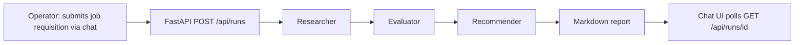

# Recruitment Assistant

A personal, single-operator multi-agent tool that turns one job requisition into a researched,
scored, and outreach-ready candidate shortlist — modeled on the [CrewAI `recruitment`
example](https://github.com/crewAIInc/crewAI-examples/tree/main/crews/recruitment) and built with the
AAMAD framework's Define → Build → Deliver workflow (see [`AGENTS.md`](AGENTS.md) and
[`CHECKLIST.md`](CHECKLIST.md)).

> **Status**: Phase 1 (Define) is complete. Phase 2 (Build) has a running MVP: FastAPI + CrewAI backend,
> Next.js chat UI, wired submit/poll API, and a QA report with a **conditional pass** (failure path
> verified; live success path needs real API keys). Next is `@security.eng`, then Phase 3 (Deliver).
> See [`project-context/2.build/qa.md`](project-context/2.build/qa.md).

Full requirements live in [`project-context/1.define/prd.md`](project-context/1.define/prd.md) (PRD) and
[`project-context/1.define/sad.md`](project-context/1.define/sad.md) (SAD). This README summarizes them;
the PRD is the source of truth for product scope if anything here drifts.

## Problem Statement & Value Proposition

Sourcing candidates, scoring them against a job's requirements, and drafting outreach messages is
repetitive manual work when done one-by-one for a single open role. This project automates that pipeline
for **one operator** (a recruiter or hiring manager working their own requisition) so that most of the
sourcing/scoring/drafting effort shifts from the operator to an automated agent pipeline, leaving the
operator to focus on writing the requisition and acting on the final report.

This is a **personal, non-commercial tool** — there is no target market, pricing, or go-to-market
strategy (see PRD §1–2, §9). Value is measured in personal time saved and in whether the operator finds
each run's report good enough to act on (see [Success Metrics](#success-metrics)).

## Key Features

MVP scope (PRD §4, Priority P0):

- **Submit a job requisition** (title, description, plus optional responsibilities, requirements,
  preferred qualifications, and perks) through a chat interface and trigger a single end-to-end run.
- **Candidate research** — find a bounded list of candidates (default: 10, max 25) with contact info and
  a brief suitability profile, sourced via web search/scraping only (no LinkedIn scraping — see
  [Architecture](#application-architecture) below).
- **Evaluate & score** — rank candidates against the requisition with a score and written justification
  per candidate.
- **Recommendation report with outreach guidance** — one markdown report with `## Recommendations` and
  `## Outreach Guidance` (methods and draft message templates). **Draft-only**: no message is sent to any
  candidate.

Deferred to Future Work (PRD §4, P2): authenticated LinkedIn sourcing, actual outreach sending,
persistent storage across runs, multi-requisition/multi-user support. The chat UI shows these as disabled
“Coming later” placeholders.

### Success Metrics

- **Recruiter time saved (hours/week)** — the primary intended benefit. There is currently no sourced
  manual-time baseline; the operator is expected to self-log their own pre-tool time so the metric has a
  real comparison point (PRD §7).
- Technical: a run completes end-to-end without manual intervention; candidate list stays within the
  bounded default to control LLM/search cost.
- UX: qualitative — the operator finds the report usable enough to act on.

## Application Architecture

A sequential, **three-agent** [CrewAI](https://github.com/crewAIInc/crewAI) pipeline
(`Process.sequential`, no inter-agent delegation), behind a FastAPI job API and a Next.js chat UI:



| Agent | Role | Goal | Tools (MVP) |
|---|---|---|---|
| `researcher` | Job Candidate Researcher | Find potential candidates for the job | `SerperDevTool`, `ScrapeWebsiteTool` |
| `evaluator` | Candidate Evaluator and Scorer | Evaluate and score candidates against the job | `SerperDevTool`, `ScrapeWebsiteTool` |
| `recommender` | Candidate Recommendation and Outreach Strategist | Recommend candidates with outreach drafts | `SerperDevTool`, `ScrapeWebsiteTool` |

**Design notes** (see PRD §3 and SAD §2–§4):

- Each stage's output feeds the next via CrewAI `Task.context` chaining.
- **The reference example's LinkedIn-cookie-scraping tool is intentionally excluded from MVP scope.**
  Candidates are sourced via public web search/scraping only. Re-adding an authenticated LinkedIn
  integration is Future Work and would need its own security/legal review.
- No database — run state is in-memory for the life of the backend process; nothing is persisted
  server-side across restarts.
- Runtime target: `crewai` (from [`aamad.config.yml`](aamad.config.yml)). LLM calls use OpenAI via
  `OPENAI_API_KEY` / `OPENAI_MODEL` (default `gpt-4o` in [`.env.example`](.env.example)); web search uses
  Serper via `SERPER_API_KEY`.
- Interface: Next.js 16 (App Router) + Tailwind chat UI on port 3000; FastAPI on port 8000
  (`POST /api/runs`, `GET /api/runs/{run_id}`, `GET /health`). The UI polls until `succeeded` or
  `failed` and surfaces errors in chat rather than failing silently.

## Getting Started

### Prerequisites

- **Python 3.13** for the backend (CrewAI/FastAPI wheels are not published for 3.14 as of this build)
- **Node.js 20+** for the frontend
- API keys: `OPENAI_API_KEY` and `SERPER_API_KEY`

### 1. Secrets

Copy [`.env.example`](.env.example) to `.env` at the repo root and fill in real keys. Never commit `.env`
(`security.forbid_committed_secrets: true`).

The FastAPI app does **not** auto-load the repo-root `.env`. Pass it when starting uvicorn (see below).

### 2. Backend

```bash
cd backend
python3.13 -m venv .venv
source .venv/bin/activate   # Windows: .venv\Scripts\activate
pip install -r requirements.txt
uvicorn app.main:app --host 127.0.0.1 --port 8000 --env-file ../.env
```

Check `GET http://127.0.0.1:8000/health` → `{"status":"ok"}`.

Unit/integration tests (mocked crew, no live LLM/search):

```bash
cd backend
.venv/bin/python -m pytest -v
```

### 3. Frontend

```bash
cd frontend
cp .env.example .env.local   # NEXT_PUBLIC_API_URL=http://localhost:8000
npm install
npm run dev                  # http://127.0.0.1:3000
```

Open the chat UI, enter a job title and description, and start a run. A full successful report needs
valid OpenAI and Serper keys loaded into the backend process. Without them the UI should still show a
`pipeline_error` in chat rather than failing silently.

## Project Structure

```
recruitment-assistant/
├── .cursor/
│   ├── agents/            # AAMAD persona definitions
│   ├── prompts/           # Phase-specific prompts
│   ├── rules/             # Always-on rules, including the crewai runtime adapter
│   └── templates/         # MRD/PRD/SAD/SFS/user-guide/user-story templates
├── backend/               # FastAPI + CrewAI (config/agents.yaml, config/tasks.yaml, tests/)
├── frontend/              # Next.js 16 chat UI (submit/poll against the FastAPI API)
├── project-context/
│   ├── 1.define/          # mrd.md, prd.md, sad.md
│   ├── 2.build/           # frontend.md, backend.md, integration.md, qa.md
│   └── 3.deliver/         # not yet populated (deploy.md, user-guide.md)
├── .env.example            # OPENAI_API_KEY, OPENAI_MODEL, SERPER_API_KEY (names only)
├── aamad.config.yml        # runtime=crewai, language=python, security/testing gates
├── AGENTS.md               # Persona index and phase workflow summary
├── CHECKLIST.md            # Define → Build → Deliver execution checklist
└── README.md               # This file
```

## Next Steps for Contributors

Phase 2 remaining / Phase 3:

- **`@security.eng`** — required before Deliver (`aamad.config.yml` →
  `security.require_security_assessment: true`). Produce `project-context/2.build/security.md`.
- **`@devops.eng`** — deploy runbook + user guide (`project-context/3.deliver/`).
- **Live success-path run** — supply real `OPENAI_API_KEY` and `SERPER_API_KEY` and start uvicorn with
  `--env-file ../.env` so the process actually sees them (see QA DEF-1/DEF-2 in
  [`qa.md`](project-context/2.build/qa.md)).
- **Time-savings baseline** — log a real manual-time-per-requisition baseline so the primary success
  metric has something to compare against (PRD §7).
- **Candidate data handling** — review LLM and search providers' data-handling terms before real
  candidate data flows through them, even though nothing is persisted server-side.
